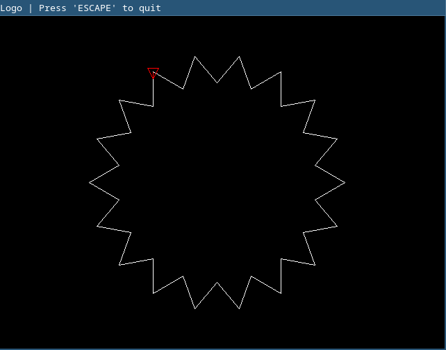
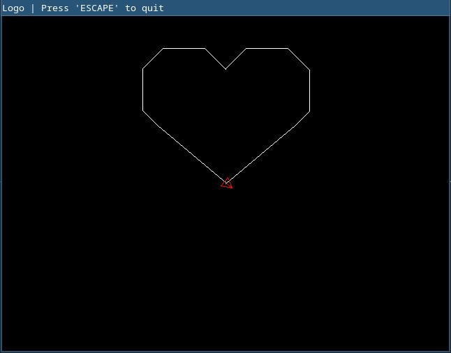
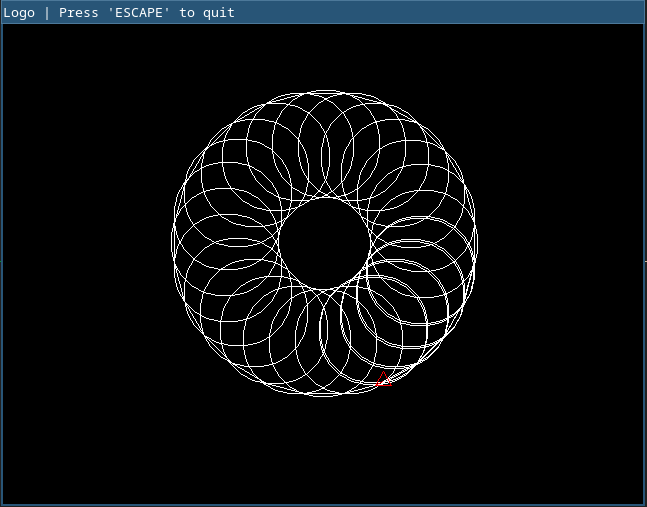

# Extremely basic turtle graphics interpreter, written in Go

This is my attempt to write a simplistic language interpreter in Go yet with some basic use-case. The turtle graphics interpreter was born. 


## The keywords

The language is very limited. It does not have support even for negative numbers :), there is no support for procedures but still has a basic loop implemented.

The available keywords (with the parameters) are here:

- **home**
- **paper** <black|white|red|green|blue|yellow|gray|magenta>
- **ink** <black|white|red|green|blue|yellow|gray|magenta>
- **pen** <down|up>
- **repeat** \<number> \<statemets> loop
- **forward** \<number>
- **back** \<number>
- **left** \<number>
- **right** \<number>

You can have a full line comment as well with `#` (see the example below)


### Example of the logo source that draws a star

```
# This example will draw a star

paper black
ink white
home

back 100
left 90
back 160

pen down

repeat 18
	forward 50
	left 100
	forward 50
	right 120
loop

```

You can find additional sample in `samples` folder

## How to run samples ?

You can find samples in `samples` folder and they can be run with the following command


To build the interpreter (uses GNU make)

```
make
```

You have to pipe the source code to the interpreter like so:

```
cat samples/star.logo | ./logo-visual 
```

## Outputs

Star



Heart



Circles




---

The only dependecy is, used by the visualizer

https://github.com/veandco/go-sdl2


